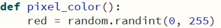
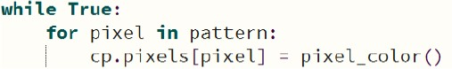

# CPX Light Pattern 1

### Introduction
This lab demonstrates the use of a list to contain the neopixel light pins numbers in a specific
repeating pattern. The ‘randint’ function is also used to create the actual light displayed.

### Procedure
- Your code should include the following:
  - A list of the pins which use it pixel at least once
  - A function that returns a tuple with the red, green and blue values randomly generated
    - Don’t forget to import the ‘random’ library!
    - 
  - Inside the infinite ‘while’ loop use a ‘for’ loop to iterate through the pattern list
    - 
  - Inside the ‘for’ loop the specific pixel should be turned on using the randomly
generated color
    - This is a flash action, so it should then be turned off by setting the pixel to black as in previous labs
- Check out this [video](https://www.youtube.com/watch?v=x3wbuOWgZCg) for an example

### Turn-in
- Upload your working code to your repo
- Upload a short video demonstrating the flashing lights (if remote)

### Grading
- Proper use of comments
- Use a list to hold the pin pattern
- Include the function which returns the tuple with three random values between 0 and 255
- Final working project
- Video demonstrating working project (if remote)

